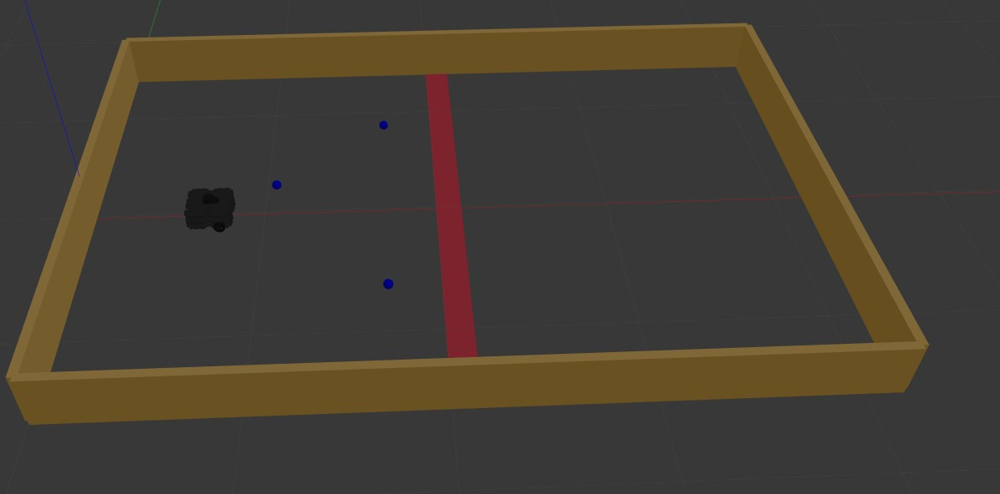
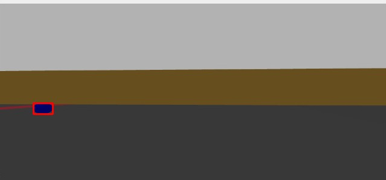

# AU_DEBI23
This repo for DEBI competition 2023 

# INSTALL 

sudo apt remove ros-noetic-dynamixel-sdk  
sudo apt remove ros-noetic-turtlebot3-msgs  
sudo apt remove ros-noetic-turtlebot3 
mkdir -p ~/catkin_ws/src  
cd ~/catkin_ws/src/ 
git clone https://github.com/YoussefAbbas2001/AU_DEBI23.git  
cd ~/catkin_ws && catkin_make 
echo "source ~/catkin_ws/devel/setup.bash" >> ~/.bashrc 

# RUN
roslaunch AU_DEBI turtlebot3_DEBI_v1.launch  
rosrun AU_DEBI ball_shooting.py  

