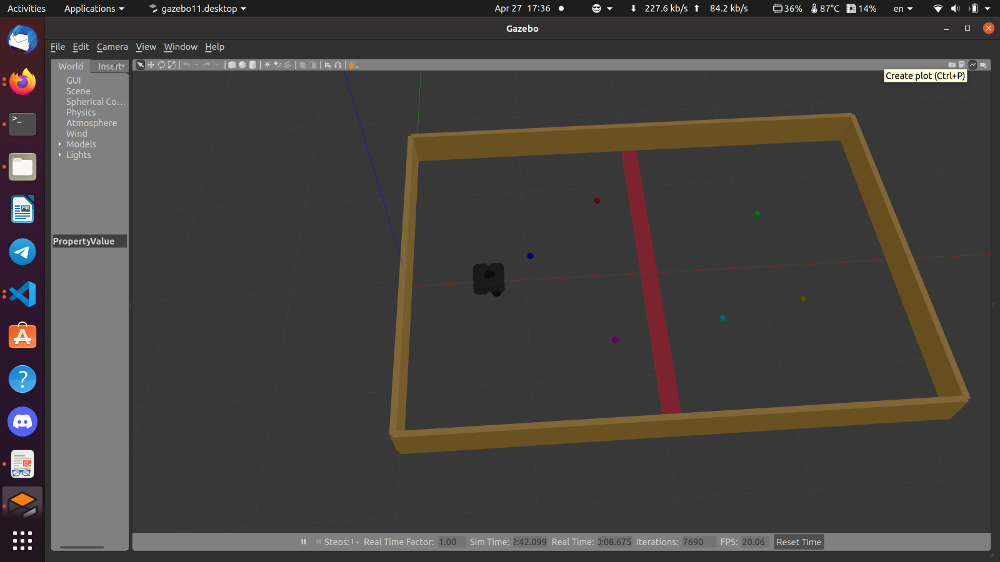
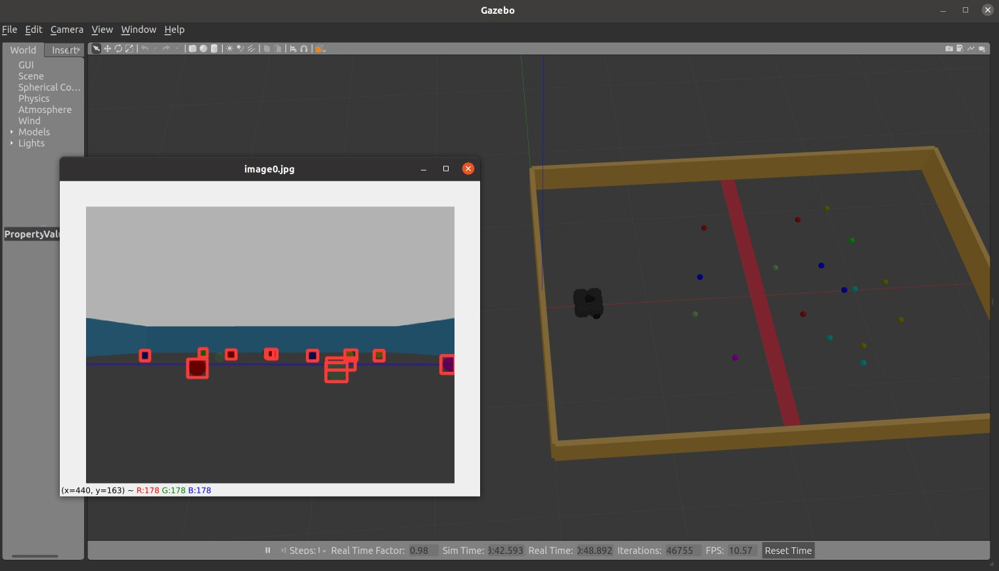
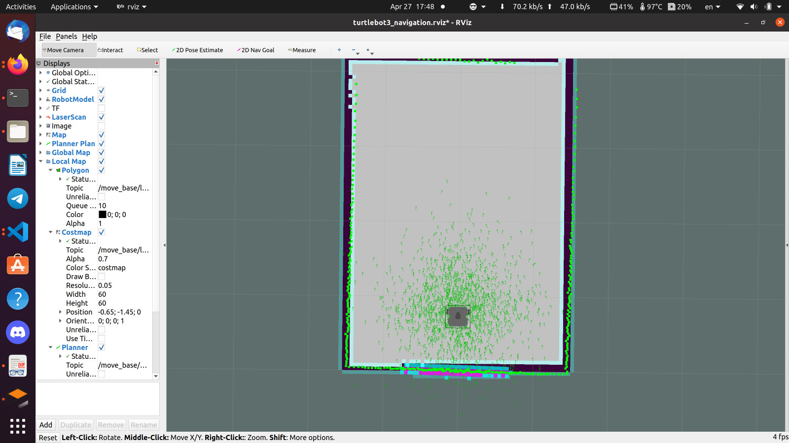

# AU_DEBI23
This is the system specified for DEBI competition 202
which Autonomous Competition with two teams oppo-
nent to each other, by shooting different color of balls in
opponent field. The team with minimum balls at the end
of the game (which is 10 min) will when the match.
We exploit LIDAR, mono camera, and wheel encoders
sensors to achieve autonomy in different sections such
as Perception we use camera model to perform object
detection with state-of-the-art model YOLOv8. We train
model on large dataset to obtain robust detection.
Robot also localize it self by Particle filter which use LI-
DAR scans to match with the predefined map, and robot
navigate through this map with DWA (dynamic widow ap-
proach) Local planner.
We also Use PID to perform position control in different
section in the map.

# 2-INSTALL 

### 2.1- Install Turtlebot dependency
sudo apt remove ros-noetic-dynamixel-sdk  
sudo apt remove ros-noetic-turtlebot3-msgs  
sudo apt remove ros-noetic-turtlebot3 
mkdir -p ~/catkin_ws/src  
cd ~/catkin_ws/src/ 
git clone https://github.com/YoussefAbbas2001/AU_DEBI23.git  
cd ~/catkin_ws && catkin_make 
echo "source ~/catkin_ws/devel/setup.bash" >> ~/.bashrc 

### 2.2- Install Yolov8 dependency
pip install ultralytics

# 3-RUN
export  TURTLEBOT3_MODEL='waffle_pi'
roslaunch AU_DEBI turtlebot3_DEBI_v2.launch  
roslaunch AU_DEBI DEBI_nav.launch  
rosrun    AU_DEBI detect_ball.py  
rosrun    AU_DEBI control.py  

# 4-DESCRIBE
## 4.1- Perception
We use Yolov8 object detection to detect and localize the ball position in camera
frame we Train a yolov8n model on a large dataset that comprise 2,000 training im-
age of solid balls with different colors we also preprocess this data (Data augment) to
add more variety on this dataset by augment Hue of images to make model less sen-
sitive to the colors.
We validated the model with 200 images and give as great Precision and Recall
which is suitable for us (we actually care about recall more than precision for DEBI
theme).

## 4.2- Localization
In Localization module we use AMCL package which is developed by ROS community
it’s just implementation of Particle filter which define multiple particle as a belief distri-
bution when robot not sure about It’s position the distribution is wide, and if the robot
confident about it’s position the distributions narrowed.
AMCL is just localizer not a SLAM algorithm so we need to give AMCL a map of the
game field and the initial position of this map. We draw the map with gmapping SLAM
and save this map with map_saver package.
AMCL return to us a (x, y, theta) of the ro-
bot on the map.
One of the problem of the AMCL is retrieval
frequency of the pose though we need
odometry to get high frequency estimation
of the position of robot, this is important for
the control system and it’s responsivity of
the system at all.
We could correct this high frequency odom-
etry by the low frequency update step with
high accuracy to achieve robust localization
system.

## 4.3- Navigation
We use DWA local planner which stand for Dynamic Window Approach local planner.
The dwa_local_planner package provides a controller that drives a mobile base in the
plane. This controller serves to connect the path planner to the robot. Using a map, the
planner creates a kinematic trajectory for the robot to get from a start to a goal location.
Along the way, the planner creates, at least locally around the robot, a value function,
represented as a grid map. This value function encodes the costs of traversing through
the grid cells. The controller's job is to use this value function to determine dx,dy,dtheta
velocities to send to the robot.

The basic idea of the Dynamic Window Approach (DWA) algorithm is as follows:
<ol>
<li> Discretely sample in the robot's control space (dx,dy,dtheta)</li>
<li> For each sampled velocity, perform forward simulation from the robot's current state to
predict what would happen if the sampled velocity were applied for some (short) peri-
od of time. </li>
<li> Evaluate (score) each trajectory resulting from the forward simulation, using a metric
that incorporates characteristics such as: proximity to obstacles, proximity to the goal,
proximity to the global path, and speed. Discard illegal trajectories (those that collide
with obstacles). </li>
<li> Pick the highest-scoring trajectory and send the associated velocity to the mobile
base. </li>
<li> Rinse and repeat. </i>
</ol>

REPO: https://github.com/YoussefAbbas2001/AU_DEBI23